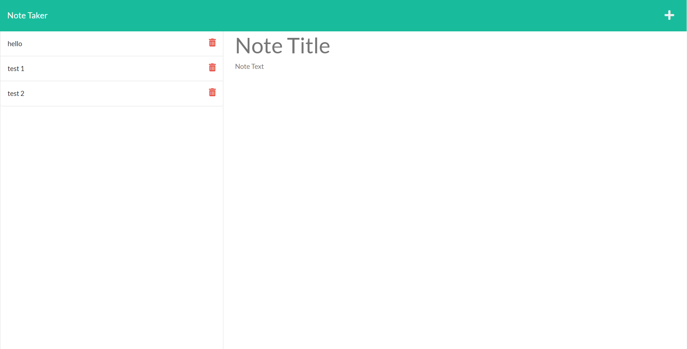

# note-taker

## Description

A note taking app that allows the user to create and save notes. This project utilizes `Node.js` and the `express` package to run on a server for routing.

## Installation

Use the command `npm i` to install the required packages.

## Usage

Use the command `node index.js` or `nodemon` to run the program. After running the commands, the user will be prompted with questions in the terminal.

## Contribution

Tiarnan Marsten

## License

